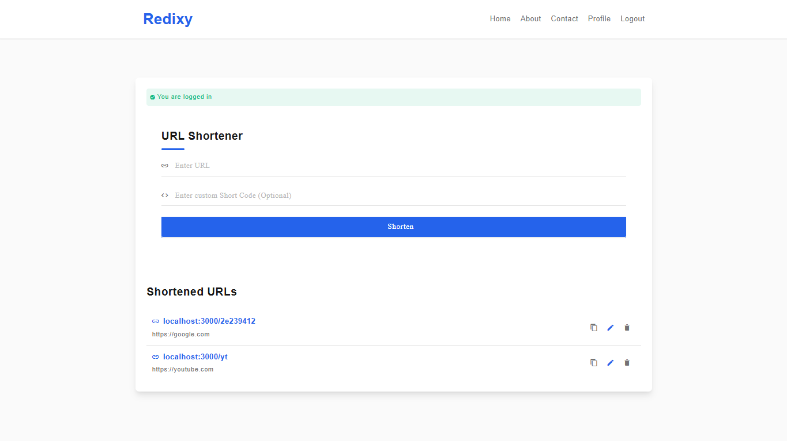

# URL Shortener 🔗

[](https://nodejs.org/)  
[](https://expressjs.com/)  
[](https://ejs.co/)  
[](#)  
[](LICENSE)  
[](https://mongoosejs.com/)

A URL Shortener web application built using Node.js, Express, EJS, MongoDB, and Mongoose, following the MVC design pattern. It allows users to shorten long URLs into compact links, store them in a database, manage them efficiently, and redirect seamlessly.

---

## 🚀 Features
- Shorten long URLs into unique short links  
- Redirect to original URLs instantly  
- Option to add **custom short URLs**  
- If no custom alias is provided, a **random hex string** is auto-generated using Node’s **crypto** module
- Persistent storage with MongoDB (managed via Mongoose ODM)
- Organized structure using **MVC pattern**  
- Server-side rendering with **EJS templates**  
- Environment-based configuration using `.env`  
- Auto-reload during development with `--watch`  

---

## 🛠️ Tech Stack
- **Backend:** Node.js, Express.js  
- **Frontend:** EJS (Embedded JavaScript Templates)
- **Database:** MongoDB (with Mongoose ODM)  
- **Architecture:** MVC (Model–View–Controller)  
- **Environment Management:** dotenv  
- **Utilities:** Node `crypto` module  
- **Version Control:** Git & GitHub  

---

## ⚙️ Installation & Setup

1. **Clone the repository**
   ```bash
   git clone https://github.com/yashsri2802/URL-Shortener.git
   cd URL_Shortener

2. **Install dependancies**
   ```bash
   npm install

3. **Create a .env file**
   Add your environment variables (example):
   ```bash
   PORT=3000
   MONGO_URI=mongodb://127.0.0.1:27017/<database_name>

4. **Run the Project**
   ```bash
   npm run dev

## 📷 Screenshot


## 🌍 Live Demo

Check out the live version of the project here:  

👉 [URL Shortener on Render](https://urlshortener-hns1.onrender.com)

## 🤝 Contributing

Contributions, issues, and feature requests are welcome!
Feel free to open an issue or create a pull request.

## 📜 License

This project is licensed under the MIT License.
You are free to use, modify, and distribute this project.
